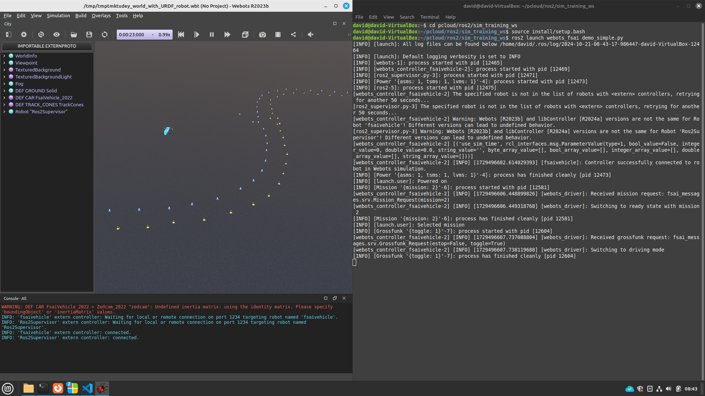
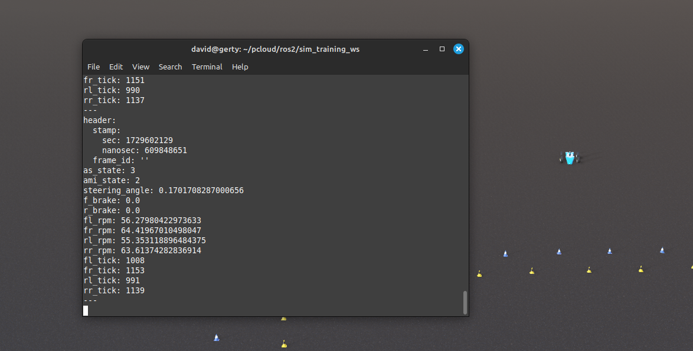
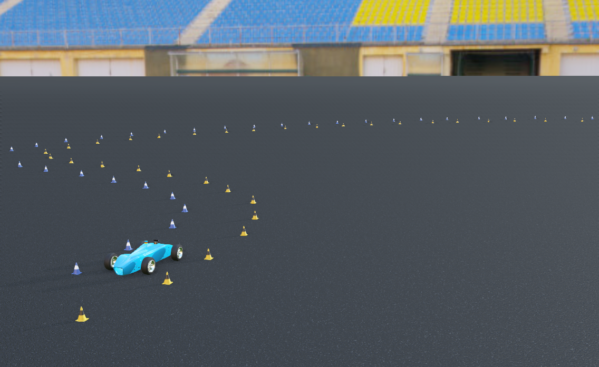
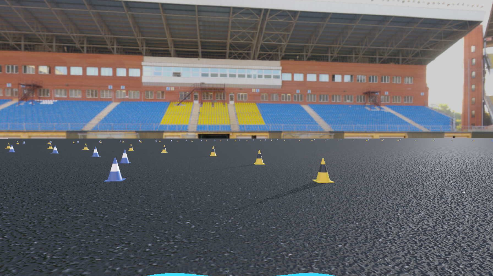
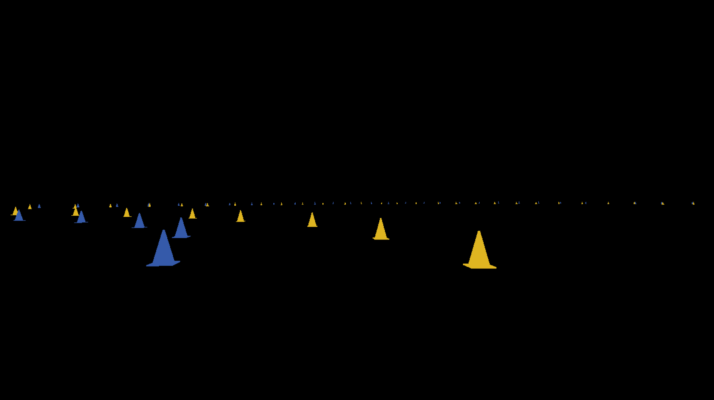

<!--
author:   David Croft

email:    david.croft@warwick.ac.uk

version:  0.0.1

language: en

narrator: US English Female

comment:  Training materials for new WRAI members.

classroom: false
icon: docs/images/wr_logo.png
-->

# fsai\_sim\_training

Visualise the materials [HERE](https://liascript.github.io/course/?https://warwick-racing.github.io/fsai_sim_training/LIA.md).

The aim of this repo is to guide you through setting up an initial ROS2 workspace to the point where you can run the Warwick fsai simulator and start understanding how ROS2 works at the level of actually running systems.

These instructions assume that you have a basic understanding on the Linux terminal.


## ROS workspace structure

A ROS2 workspace is simple a directory containing the resources needed to run a project.
It will typically consists of multiple ROS2 packages, where each package may be dependent on one or more of the other packages.

A ROS2 package is simple a directory that contains the resources needed to run a specific part of a project.

For the examples in this guide we are going to be making use of the following custom packages.

- **fsai\_common**
- **fsai\_messages**
- **fsai\_sim_training**
- **ros2\_differential_drive**
- **webots\_fsai**

As well as multiple default packages that we will install to the machine and do not need to worry about copying into this workspace.

The folder structure that we are aiming to achieve is shown below, as you can see below each package is a separate folder under the src/ directory.

``` ascii
+- training_ws/
+-+- install/
  +- src/
  +-+- fsai_common/
    +- fsai_messages/
    +- fsai_sim_training/
    +- ros2_differential_drive/                                      
    +- webots_fsai/
```

### Packages in this example workspace.

Listed in alphabetical order, not priority.

**fsai\_common**

Containing common functionality that the vehicle requires, both simulated and real.
For example common configuration files, or control code for missions such as STATIC\_INSPECTION\_A which functions identically in both simulation and reality.

**fsai\_messages**

Containing message and service definitions. 
These describe the formats of the messages that the various ROS nodes will use to communicate with each other.

These are kept in their own package because multiple packages need to know the message formats.

**ros2\_differential\_drive**

An example of a ROS package handling a specific piece of functionality. 
In this case the package performs odometry calculations based on wheel rotations.

Importantly, this was a originally a pre-existing node produced by the ROS community. We were able to take an modify the node to meet our specific needs rather than having to create everyting from scratch.

**webots\_fsai**

Containing the files needed to simulate the vehicle in the Webots simulator. 
As much as possible the simulated vehicle attempts to duplicate the behavior of the real vehicle, e.g. producing the same messages (as defined in fsai_messages) that the real vehicle would.


## Setting up the workspace

Using the terminal.

{{1}}
> Create the folders.
> 
> - `mkdir -p training_ws/src`

{{2}}
> Move to src/ directory.
> 
> - `cd training_ws/src`

{{3}}
> Clone the Git repos containing the packages.
> 
> - `git clone git@github.com:Warwick-Racing/fsai_common.git`
> - `git clone git@github.com:Warwick-Racing/fsai_messages.git`
> - `git clone git@github.com:Warwick-Racing/fsai_sim_training.git`
> - `git clone git@github.com:Warwick-Racing/ros2_differential_drive.git`
> - `git clone git@github.com:Warwick-Racing/webots_fsai.git` 

{{4}}
> Return to root dir of workspace.
> 
> - `cd ..`


### Building the workspace

{{1}} 
> Ensure that ROS humble is sourced.
>
> - `source /opt/ros/humble/setup.bash`


{{2}} 
> If you have not done so yet, install other dependencies for ROS Humble.
> 
> - `sudo apt-get install ros-humble-ackermann-msgs`
> - `sudo apt-get install ros-humble-webots-ros2-driver`
> - `sudo apt-get install ros-humble-tf-transformations`

{{3}} 
> Build workspace.
> 
> - `colcon build --symlink-install`


## Running ROS nodes

Before you can use the contents of your workspace you need to source it.
You can have multiple different workspaces in various stages of development or use at any one time. ROS needs to know which one you are mean when you run its commands.

Using the terminal from the workspace directory.

{{1}} 
> Source the workspace.
> 
> - `source install/setup.bash`

{{2}} 
> List the executable nodes within the fsai_sim_training package.
> 
> - `ros2 pkg executables fsai_sim_training`

{{3}} 
> Run the demo ROS node.
> 
> - `ros2 run fsai_sim_training demo`

If everything is successful this will run the *demo* node from the *fsai\_sim\_training* package and something like the following will appear in the terminal:

```
[INFO] [1720708128.676359008] [minimal_publisher]: Publishing: "Hello World: 0"
[INFO] [1720708129.138447369] [minimal_publisher]: Publishing: "Hello World: 1"
[INFO] [1720708129.637026928] [minimal_publisher]: Publishing: "Hello World: 2"
[INFO] [1720708130.138686990] [minimal_publisher]: Publishing: "Hello World: 3"

```

{{4}} 
> Press Ctrl+C to kill the node.


## Running a minimal simulation

Whilst it is possible to run ROS nodes individually, it quickly becomes unmanageable for anything but the smallest of projects. 
Instead we run launch files that contain the instructions to run and correctly configure multiple nodes.

Launch files are the main way that you will interact with ROS. 
For example, a simple launch file that only uses functionality from the **webots\_fsai** package.

From the terminal in the workspace directory.

{{1}} 
> Run the launch file. This will launch multiple ROS nodes.
> 
> - `ros2 launch webots_fsai demo_simple.py`

If everything is successful the webots simulator should launch and the simulated vehicle should start moving.

The vehicle is going to swerve off the track almost instantly but that's all we are telling the vehicle is do it go forwards while steering left. The point is that the vehicle has moved.

{{2}} 
> Press Ctrl+C to stop the simulation.




### demo\_simple.py

The **demo\_simple.py** launch file consists of 3 parts:

**webots\_launch.py**

- This calls the **webots\_fsai** **start\_simulator** launch file which in turns starts the webots simulator and runs the webots/ROS driver node.

---------------------

**vehicle\_launch.py**

- This calls the **webots\_fsai** **start\_vehicle** launch file and emulates vehicle start up process from the real vehicle.

--------------------

**ctrl**

- Publishes a simple control commmand to the vehicle, in this case go forwards while steering left.


### start\_simulator.py

Launch files can include other launch files so it makes sense to break functionality into separate launch files and to them combine as needed. This is especially useful when certain functionality is going to be reused, e.g. starting the simulator.

The **start\_simulator.py** launch file is a good example of this. It is used in all the other launch files that start the simulator, it:

1. Loads webots.
2. Runs the driver node that translates between webots and ROS.
3. Tidies up when the simulation is closed.

### start\_vehicle.py

The **start\_vehicle.py** launch file is another example. The webots vehicle emulates the real vehicle start up process so that we can test how the rest of the software stack responds. But most of the time we just want to get the vehicle moving. The launch file does just that by automatically:

1. Powering on the vehicle.
2. Selecting a mission.
3. Making the vehicle active (toggling the grossfunk).


### ROS graph

So our **demo\_simple.py** launch file ends up running multiple separate nodes that are all working together to make the vehicle move.

The diagram below shows how the nodes are connected to each other.

- Webots is the simulator we are using.
- **webots\_driver** is the node that translates between webots and ROS.
  
  - If we changed the simulation software we would need to change this node.
  - But nothing else would need to change.
  
- **power**, **select\_mission** and **toggle\_grossfunc** send one off commands (ROS service calls) to the vehicle to step through the start up process.
  
- **ctrl** sends a continuous stream of data (ROS topic) with desired speed, steering and braking information.
  
  - For safety reasons on the real vehicle, the vehicle automatically stops if it does not receive a control command for a certain amount of time.
  - The simulated vehicle has no safety concerns but works the same way because otherwise it wouldn't be an accurate simulation.

This is the simplest possible setup we can use to get the vehicle moving in the simulator.

``` ascii                             
+-----------+   .-- ROS -----------------------------------------------.
|           |   |   +---------------+              +------+            |
|  Webots   *------>|               |              |      |            |       
| Simulator |<------* webots_driver |<--- /ctrl ---* ctrl |            |
|           |   |   |               |              |      |            |      
+-----------+   |   +---------------+              +------+            |
                |       ^       ^ ^                                    |
                |       |       |  \                                   |
                |       |       |   .------------.                     |
                |       |       |                 \                    |
                |   +---o---+ +-o--------------+ +-o----------------+  |
                |   |       | |                | |                  |  |
                |   | power | | select_mission | | toggle_grossfunc |  |
                |   |       | |                | |                  |  |
                |   +-------+ +----------------+ +------------------+  |
                .------------------------------------------------------.
```

## WRAI topic formats

For the most part the WRAI team uses the standard ROS2 message formats.
These suffice for most of the data that we need to pass between nodes.

For example, image and depth information from the stereo camera (ZEDCAM) can be passed as standard ROS2 image messages.
Lidar data can be passed as standard ROS2 point cloud messages.

However for the control commands going to the vehicle and the status information coming from the vehicle, custom message formats are used because it is the only way to represent all the information that is passed.

The **fsai\_messages** package contains the custom message formats that are used by the WRAI team. 
The formats are in their own package as they are needed by multiple other packages, i.e. both the simulation control node and the real vehicle control node need to know the same message format so that code written to one will work seamlessly with the other.

### fsai_messages/Control

**fsai\_messages/Control** is the message format to send control commands to the vehicle. 
It has the following structure.

``` txt fsai_messages/Control
float32 steer_angle
float32 brake_press_f
float32 brake_press_r
float32 axle_speed_f
float32 axle_speed_r
uint8 state

uint8 NORMAL = 0
uint8 FINISHED = 1
uint8 EBRAKE = 2
uint8 NORMAL_MS = 3
```

- **steer\_angle** is the desired steering angle in radians.
- **brake\_press_f** and **brake\_press\_r** are the desired brake pressures for the front and rear axles respectively on a scale of $[0.0 1.0]$.
- **axle\_speed_f** and **axle\_speed\_r** are the desired speeds for the front and rear axles respectively.
  
  - Depending on the value of **state** these can be in either rpm or m/s.
- **state** should be one of the follow.

  - **NORMAL**, the vehicle can move and speed information is given in rpm.
  - **FINISHED**, the vehicle has completed its mission and should stop.
  - **EBRAKE**, the vehicle should stop immediately due to an issue.
  - **NORMAL_MS**, the vehicle can move and speed information is given in m/s.

### fsai_messages/Status

**fsai\_messages/Status** is the message format to receive status information from the vehicle.

It has the following format:

``` txt fsai_messages/Status
std_msgs/Header header
uint8 as_state
uint8 ami_state
float32 steering_angle
float32 f_brake
float32 r_brake
float32 fl_rpm
float32 fr_rpm
float32 rl_rpm
float32 rr_rpm
uint16 fl_tick
uint16 fr_tick
uint16 rl_tick
uint16 rr_tick

uint8 AS_OFF             = 1
uint8 AS_READY           = 2
uint8 AS_DRIVING         = 3
uint8 AS_EMERGENCY_BRAKE = 4
uint8 AS_FINISHED        = 5

uint8 AMI_NOT_SELECTED        = 0
uint8 AMI_ACCELERATION        = 1
uint8 AMI_SKIDPAD             = 2
uint8 AMI_AUTOCROSS           = 3
uint8 AMI_TRACK_DRIVE         = 4
uint8 AMI_STATIC_INSPECTION_A = 5
uint8 AMI_STATIC_INSPECTION_B = 6
uint8 AMI_AUTONOMOUS_DEMO     = 7
```

- **header** is the standard ROS message header and contains information such as timestamp.
- **as\_state** is the state of the autonomous system.
  
  - It will have a value of **AS\_OFF**, **AS\_READY**, **AS\_DRIVING**, **AS\_EMERGENCY\_BRAKE** or **AS\_FINISHED** depending on the current state of the vehicle.
  - **AS\_DRIVING** means that the vehicle is active and can be driven.
- **ami\_state** is the current mission.
  
  - Possible values should be self explanatory and on the real vehicle will reflect what was selected on the side screen.
- **steering\_angle** is the current steering angle in radians.
- **f\_brake** and **r\_brake** are the current brake pressures for the front and rear axles respectively.
- **fl\_rpm**, **fr\_rpm**, **rl\_rpm** and **rr\_rpm** are the current speeds of the front left, front right, rear left and rear right wheels respectively.
- **fl\_tick**, **fr\_tick**, **rl\_tick** and **rr\_tick** are the current tick counts for the front left, front right, rear left and rear right wheels respectively.

  - The vehicle produces 20 ticks per wheel revolution.

### Viewing ROS topics

To see an example of this data use the `ros2 topic` commands.

{{1}} 
> Run the demo launch file as before.
> 
> - `ros2 launch fsai_sim_training demo_simple.py`

{{2}} 
> In a new terminal window.
> 
> - Make sure to source the workspace.
> - `source install/setup.bash`

{{3}} 
> View a list of all topics.
> 
> - `ros2 topic list`

{{4}} 
> View information about a specific topic.
> 
> - I.e. **/status**.
> - `ros2 topic info /status`

{{5}} 
> View the actual data being published on a topic.
> 
> - `ros2 topic echo /status`  
  



## Next steps

Try running an example that is a bit more complex and closer to what we would be running on the real vehicle.

One possible architecture is to have a single launch file that runs the nodes for all possible missions. 
However only one mission is actually active at a given time. 
In this example, each mission has a seperate node that outputs the control commands for that mission.
These are all passed to the **control\_multiplexer** node which forwards the commands from the mission that is actually selected at that time.

The **static\_a**, **static\_b**, **autonomous\_demo**, **acceleration** and **control\_multiplexer** nodes are all listening (subscribing) to the /status topic.

The **/status** topic contains the information that the car generates about its current state. 
I.e. current mission, current speed/steering/brakes, wheel ticks etc.
The mission nodes need this information to complete successfully.
For example autonomous_demo needs to know when it has traveled the required distance.

{{1}}
> Run the example launch file.
>
> - `ros2 launch fsai_sim_training example_manual.py`

!?[](docs/videos/manual_control.mp4)

example_manual

``` ascii
                .-- ROS ---------------------------------------------------------.
                |   +----------------+                                           |
                |   |                |                  +----------+             |
                |   | manual_control |                  |          |             |
                |   |                |            .---->| static_a *----------.  |
                |   +-------o--------+            |     |          |          |  |
                |           |                     |     +----------+          |  |
+-----------+   |           V                     |                           |  |
|           |   |   +---------------+             |     +----------+          |  |
|  Webots   *------>|               |             |     |          |          |  |   
| Simulator |<------* webots_driver *-- /status --+---->| static_b *--------. |  |
|           |   |   |               |             |     |          |        | |  |      
+-----------+   |   +---------------+             |     +----------+        | |  |
                |           ^                     |                         | |  |
                |           |                     |  +-----------------+    | |  |
                |         /ctrl                   |  |                 |    | |  |
                |           |                     +->| autonomous_demo *--. | |  |
                |   +---------------------+       |  |                 |  | | |  |
                |   |                     |       |  +-----------------+  | | |  |
                |   | control_multiplexer |<------+                       | | |  |
                |   |                     |       |   +--------------+    | | |  |
                |   +---------------------+       |   |              |    | | |  |
                |             ^ ^ ^ ^             .-->| acceleration *--. | | |  |
                |             | | | |                 |              |  | | | |  |
                |             | | | |                 +--------------+  | | | |  |
                |             | | | |                                   | | | |  |
                |             | | | .-- /accel_ctrl --------------------. | | |  |
                |             | | .---- /demo_ctrl -----------------------. | |  |
                |             | .------ /static_b_ctrl ---------------------. |  |
                |             .-------- /static_a_ctrl -----------------------.  |
                .----------------------------------------------------------------.
```


## Advanced

What we have seen so far is the most basic usage of the WRAI simulator stack. 
In this section we will see some more advanced features that can be used to customize the simulation.

### Cheating

One of the biggest advantages of using a simulator is that we can querying the simulator directly for information. 

The standard `webots_driver` node automatically publishes additional information from the sensor whenever you add a sensor to your simulated vehicle.

For example, if you enable recognition and segmentation on your simulated cameras, you will get object detections and image segmentation masks published automatically. 
These are generated straight from the simulation and so are 100% accurate, they can also be used to easily generate ground truth or training data for machine learning models. 

  

> **WARNING**
>
> For the moment the default **ros-humble-webots-ros2-driver** package that can be installed in Ubuntu does not automatically produce the image segmentation masks.
>
> We have added that to the code and we have a pull request open to get that functionality added to the default package but it's not been added at time of writing (Oct 2024).
>
> To get this functionality you will need to compile our fork of the package from source. Fortunately this is very easy to do.
>
> {{1}}
> > Clone the fork into the **src** directory of your workspace.
> >
> > - `git clone https://github.com/dscroft/webots_ros2.git src/webots_ros2`.
> 
> {{2}}
> > Build your workspace as normal.
> >
> > - `colcon build --symlink-install`.


### Example

The **webots\_driver.py** node included in the **webots\_fsai** package has been written to automatically publish further information that will not be so easily acquired in the real world. 

- The position and orientation of the vehicle in the simulated world.
- The position and colour of all cones in the simulated world.

This data is passed as a XYZRGB pointcloud message on the **/cones** topic.

In real life if we want to know the positions of the cones we need to develop a full perception pipeline to e.g.:

1. Connect to the camera hardware.
2. Recognise the cones in the image. 
3. Estimate their distance from the camera.
4. Convert that pixel and distance information into a 3D position.
5. Track the position of the vehicle.
6. Integrate the relative positions of the cones with the vehicle's position over time so that we can remember where cones are even if they've gone out of view. 
7. Plan a path through the cones.
8. Generate the control commands to follow that path.

This is basically the entire challenge of the Formula Student competition.

In the simulator we can skip the perception portion (steps 1-6) just ask the simulator where the cones are. 
This is a huge advantage because if you are working on the path planning/optimisation/following elements (steps 7-8) you can simply ignore the perception problem. 
This is a huge time saving and means that you can be working in parallel with the perception team rather than having to wait for them to finish.

### follow\_breadcrumbs.py

The **follow\_breadcrumbs.py** launch file in the **fsai\_sim\_training** package is an example of how to use 'god-mode' information from the simulator to create a simple path following system.

{{1}}
> This launch uses some additional packages. Add the **fsai\_delanauy** package to the **src/** directory of your workspace.
> 
> - `git clone git@github.com:dscroft/fsai_delaunay.git src/fsai_delaunay`.
> - `colcon build --symlink-install`.

{{2}}
> Run `ros2 launch fsai_sim_training follow_breadcrumbs.py` to see the vehicle follow a path through the cones.

!?[](docs/videos/breadcrumbs.mp4 "Simulated vehicle running using the follow_breadcrumbs.py launch file.")

**webots\_driver** is our standard node that translates between the Webots simulator and ROS.
**power**, **select\_mission** and **toggle\_grossfunc** were covered previously.

Because **webots\_driver** is communicating to a simulated environment rather than reality, it can query the position of the cones in the simulated world.
This information is published as the **/cones** topic in ROS.

--------------------------

**delaunay** is a node that takes the cone positions and generates a series of "gates".

'Gate' in this context is a blue/yellow pair of cones that are approximately 3.5m apart.

--------------------------

**breadcrumbs** is a node that takes:

- The vehicles position and heading (via the **/tf** topic).
- The position of the gates (via the **/gates** topic).

It then outputs the steering angle required to drive at the nearest gate in front of the vehicle via the **/steer\_angle** topic.

--------------------------

The **ctrl** node is a simple node that takes the steering angle, combines it with a fixed speed and publishes the standard format control commands to the vehicle.

The node uses the cone and vehicle information being published by the simulator and simply drives at the nearest gate in front of the vehicle.


``` ascii                             
                .-- ROS -----------------------------------------------.
                |   +-------+ +----------------+ +------------------+  |
                |   |       | |                | |                  |  |
                |   | power | | select_mission | | toggle_grossfunc |  |
                |   |       | |                | |                  |  |
                |   +---o---+ +-o--------------+ +-o----------------+  |
                |       |       |                 /                    |
                |       |       |   .------------.                     |
                |       |       |  /                                   |
+-----------+   |       V       V V                                    |
|           |   |   +---------------+              +----------+        |
|  Webots   *------>|               |              |          |        |       
| Simulator |<------* webots_driver *-- /cones --->| delaunay |        |
|           |   |   |               |              |          |        |      
+-----------+   |   +-------------*-+              +-------*--+        |
                |      ^           \                       |           |
                |      |            .---- /tf ------.   /centers       |
                |    /ctrl                          |      |           |
                |      |                            V      V           |
                |   +--*---+                      +-------------+      |
                |   |      |                      |             |      |
                |   | ctrl |<---- /steer_angle ---* breadcrumbs |      |
                |   |      |                      |             |      |
                |   +------+                      +-------------+      |
                |                                                      |
                .------------------------------------------------------.
```


